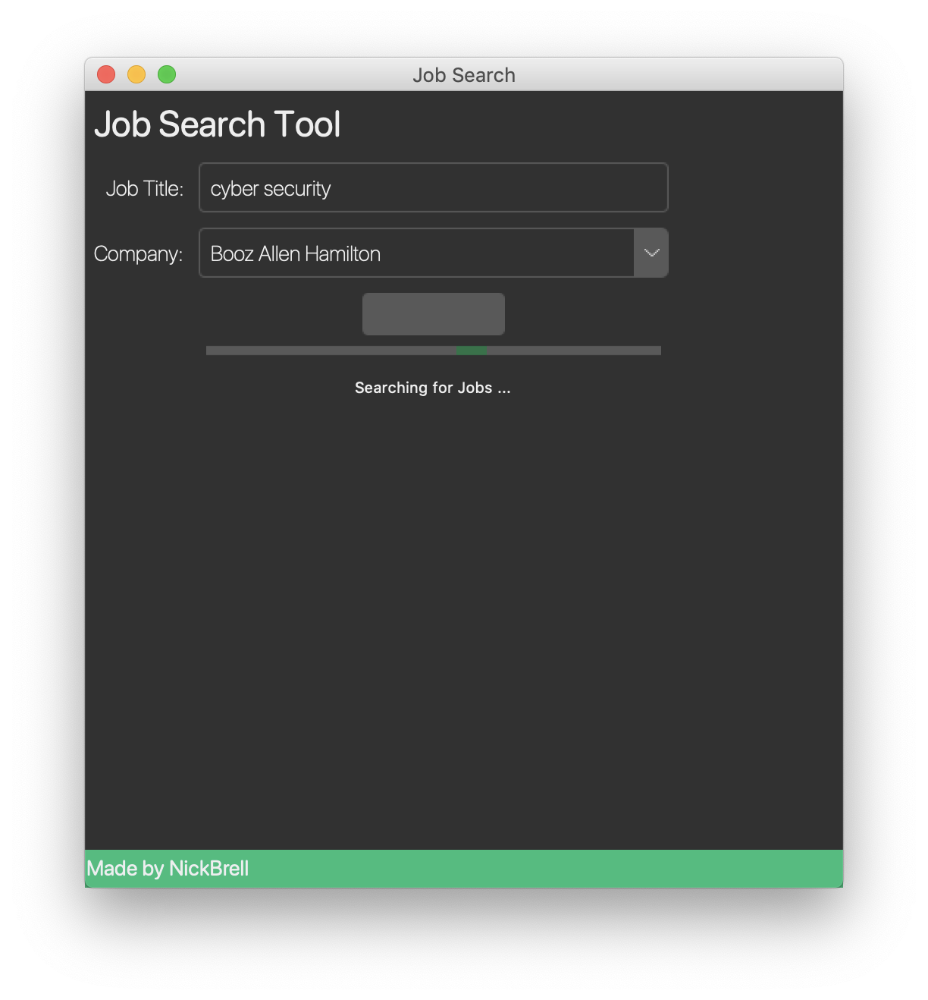
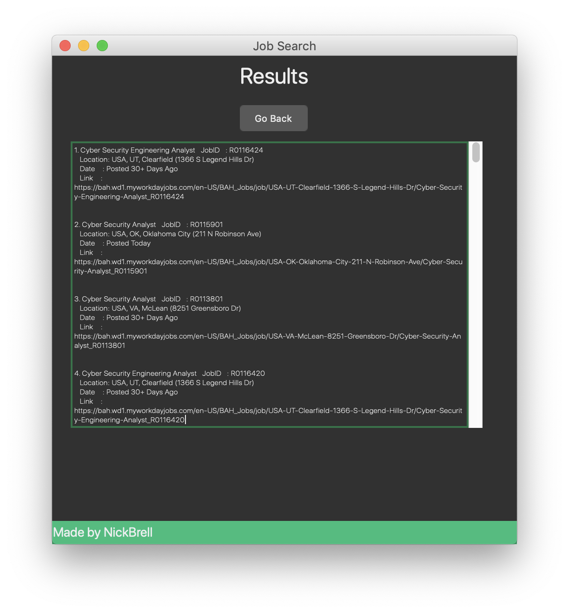

# Workday-Job-Scraper-GUI

## Description
 - This is an application I created that scrapes for job postings on WorkDay websites. I created a web scraping script ([`scripts/jobsSearch.py`](https://github.com/nickb210/Workday-Job-Scraper-GUI/blob/master/scripts/jobsSearch.py)) which uses [Selenium](https://selenium-python.readthedocs.io/) to automate a job search based on user input. I also created a link generator ([`scripts/workday_linkgen.py`](https://github.com/nickb210/Workday-Job-Scraper-GUI/blob/master/scripts/workday_linkgen.py)) so the link for each job posting can be returned to the user. When using this application the following fields are returned to the user for each job posting:
    - Job Title
    - Job Location
    - Job Posting Date
    - Link to job posting

## Instructions
1. `pip3 install -r requirements.txt`
2. `python3 app.py`

## Demo

